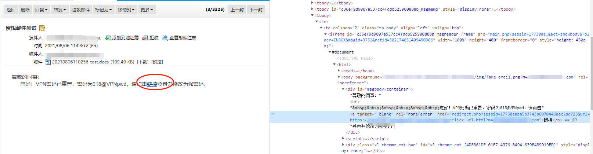

# rock-mailbait-go

rock-go框架的邮件蜜饵生成组件，需要配合邮件组件发送。该组件根据配置的各链接和收件人等，发送一封带有隐藏链接的邮件到收件人，当该邮件被打开时，后台系统 会记录到日志，根据日志进行分析，以判断该邮件是否为正常用户打开。

# 使用说明

## 导入

```go
import mailbait "github.com/rock-go/rock-mailbait-go"
```

## 注册

```go
rock.Inject(env, mailbait.LuaInjectApi)
```

## lua 脚本调用

```lua
-- 邮件发送模块
local email = rock.email {
    name = "email",
    server = "mail.qq.com",
    port = 25,
    from = "xxx@qq.com",
    password = "xxxxxxxxxxxxx",
    buffer = 100
}
proc.start(email)

-- 蜜饵生成
local bait = rock.mail_bait {
    name = "mail_bait",
    email = email,
    --to = "xxxx@qq.com,yyyy@qq.com",
    to = "resource/mail_user.txt",
    subject = "蜜饵邮件测试",
    mail_link = "https://xxx.abc.com/assets/img/fake_email.png?m=",
    click_link = "https://xxx.abc.com/assets/img/click_url.html?m=",
    attach_link = "https://xxx.abc.com/assets/img/open_docx.jpg?pn=",
    content = "尊敬的同事：<br>&nbsp;&nbsp;&nbsp;&nbsp;&nbsp;&nbsp;您好！VPN密码已重置，密码为618@VPNpwd，请点击<a href='{CLICK_LINK}'>链接</a>登录并修改为强密码。",
    attachment = "resource/test.docx",
    heartbeat = 60
}

proc.start(bait)

-- 发送，根据配置自动生成蜜饵邮件的正文和附件。一次只允许一个任务发送，当有任务正在进行时，只能关闭或等待。
bait.send()

-- 查看当前任务进度
local prog = bait.progress()
print(prog)

-- 生成单个蜜饵附件
bait.new_attach("resource/test.docx", "https://xxx.abc.com/assets/img/open_docx.jpg?pn=xxx@qq.com")
```

### 参数说明

- name: string, 模块名称
- email: 邮件发送模块
- to: string, 蜜饵邮件收件人。 逗号分割的邮箱列表，或包含邮箱列表的文件，换行符分割。
- subject: string，邮件主题
- mail_link: string, 包含在蜜饵邮件中的隐藏链接，该链接会放在邮件正文的\<body background="mail_link">\</body>标签中，会在链接结尾带上邮箱标识，以供后续日志分析
- attach_link: string, 包含在蜜饵附件中的隐藏链接，该链接会被放置在新生成的附件中。
- click_link: string, 包含在蜜饵邮件中的显示链接，该链接会放在邮件正文的超链接中，点击之后触发特定页面
- content: string, 邮件正文内容，支持html格式。当有显示链接时，用<font color="red">{CLICK_LINK}</font>占位，发送时，会以click_link配置的值进行替换
- attachment: string, 原始附件列表，逗号分割，模块会处理这些附件，添加attach_link到附件生成蜜饵附件并发送，为空则不发送附件
- heartbeat: int, 发送进度信息打印时间间隔。

### 示例

示例代码中，生成的邮件如图
